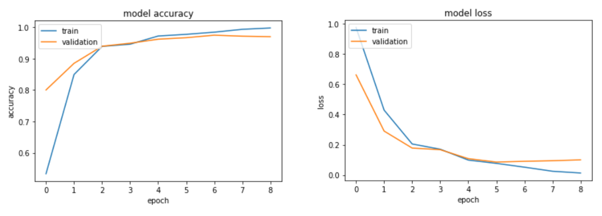
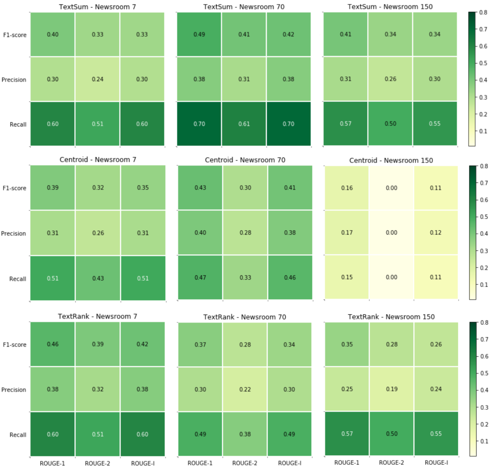

# Bachelor/Data Science/Linnaeus University
##### tags: Text Classifcation, POS tagging, Noun Phrase Chunking, NER tagging, Text Summarization


## Directory tree

```
.
├── README.md
└── main
    ├── data
    │   ├── _subjects
    │   │   ├── biology
    │   │   ├── geography
    │   │   └── physics
    │   │ 
    │   ├── block_1.csv
    │   ├── block_2.csv
    │   └── block_3.csv
    │
    ├── utils
    │   ├── heatmap_sum.ipynb
    │   ├── heatmap_tc.ipynb
    │   ├── newsroom_dataset.ipynb
    │   ├── nlp.ipynb
    │   ├── nlp_tc.ipynb
    │   ├── np.ipynb
    │   ├── rouge.ipynb
    │   └── text.ipynb
    │
    ├── centroid.ipynb
    ├── gensim.ipynb
    ├── glove.ipynb
    ├── ner_pos.ipynb
    ├── nltk_ner_pos.ipynb
    ├── tc_svm.ipynb
    ├── textrank.ipynb
    └── textsum.ipynb
    

```
###### # This repo reflects mostly our final work in Jupyter Lab.

## Missing datasets and other sources (due to max size in repo)


### Cornells Newsroom (ROUGE test dataset)

You have to apply for it at [Newsroom](https://summari.es/download/). Place the 'train.jsonl.gz' (size approx 2GB) in _data_ directory.

### Subject corpus

In directory _data_ you will find our small balanced dataset in _\_subjects_, but the big unbalanced one did not fit this repo, otherwise placed in _data/subjects_ (in our Jupyter notebook).

###  GloVe  

Create a directory in main called 'glove.6B' (or it comes with the zip with additional files) and download 'glove.6B.100d.txt' from: [Stanford](https://nlp.stanford.edu/projects/glove/) (glove.6b.zip, size 822MB).

NOTE: glove.ipynb does not work well with the present small Subject corpus


### StanfordNERTagger 

To use StanforNERTagger (ner_pos.ipynb) you need to download [Stanford Named Entity Recognizer version 3.9.2](https://nlp.stanford.edu/software/stanford-ner-2018-10-16.zip) (instant download). For more information before download [Stanford](https://nlp.stanford.edu/software/CRF-NER.shtml). Place the directory in _main_.


## Main notebooks


### [centroid.ipynb](main/centroid.ipynb)/ Automatic Text Summarization
Implementation of [Centroid-based Text Summarization throughCompositionality of Word Embeddings](https://www.aclweb.org/anthology/W17-1003.pdf)
from their [Github repo](https://github.com/lambdaofgod/text-summarizer.git).

### [gensim.ipynb](main/gensim.ipynb) / Automatic Text Summarization (not include in the report)

Gensim text summarization did not do well on our Subject corpus texts. They did though very well on one text from our small ROUGE test (Convell Newsroom), with an 0.64 F1-score.

### [glove.ipynb](main/glove.ipynb)/ Text Classification (not included in the report)

A **Text Classification** test on our big Subject corpus with **1D convolutional layer** with a pre trained word embedding, **GloVe**. The basic solution is from [keras.io](https://keras.io/examples/pretrained_word_embeddings/). 

We changed the optimizer _rmsprop_ to _adam_ (imported, to be able to change parameters) and fiddled only with the learning rate, while keras recommends not to touch other defaults. Validation accuracy leveled out in epoch 7, just above 97% (an improvment of 1% from _rmsprop_). We tried _Dropout_ and _Flatten_ without positive gains and in the end it is not an improvment compared to our lighter SVM TD-IDF model.



### [ner_pos.ipynb](main/ner_pos.ipynb)/ NER and POS tagging
##### wrappers included: StanfordNERTagger, stanfordnlp.Pipeline, spaCy, allennlp.predictors

### [nltk\_ner_pos.ipynb](main/ner_pos.ipynb)/ NER and POS tagging, Noun Phrase Chunking

### [tc_svm.ipynb](main/tc_svm.ipynb)/ Text Classification


### [textrank.ipynb](main/textrank.ipynb)/ Automatic Text Summarization

Implementation of [Variations of the Similarity Function of TextRank for Automated Summarization](https://arxiv.org/pdf/1602.03606.pdf)
from their [Github repo](https://github.com/summanlp/textrank).

### [textsum.ipynb](main/textsum.ipynb)/ Automatic Text Summarization
Our own extension of an **nltk frequency algorithm**, with an **Automated Query Weighting**.




###### A small ROUGE test for three text summarization models on 3 samples from Cornells Newsroom